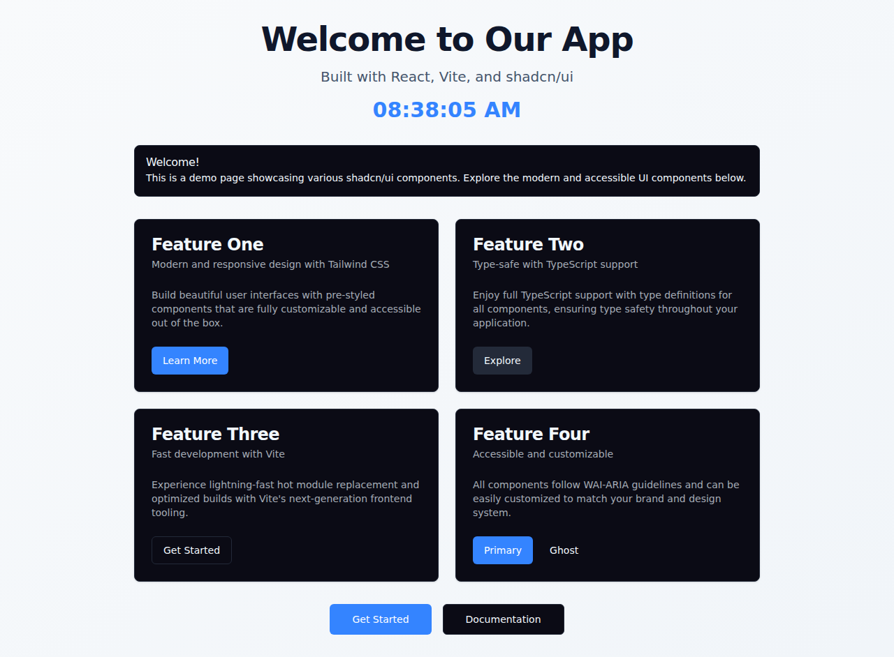

# agbr-test

A modern React monorepo built with pnpm workspaces, Turborepo, Vite, TypeScript, Tailwind CSS v4, shadcn/ui, and agent-browser for automated testing. 



## 🚀 Tech Stack

- **React 19.2** - Latest React version with improved performance and features
- **Vite 7.3.1** - Next-generation frontend tooling with lightning-fast HMR
- **TypeScript 5.9.3** - Type-safe development experience
- **Tailwind CSS v4.1** - Latest version with CSS-first configuration and OKLCH colors
- **shadcn/ui** - Beautiful, accessible UI components built with Radix UI
- **agent-browser** - Browser automation CLI for AI agents and testing
- **pnpm workspaces** - Fast, disk space efficient package manager
- **Turborepo** - High-performance build system for monorepos

## 📦 Monorepo Structure

```
agbr-test/
├── .agents/                    # Agent skills
│   └── skills/
│       └── agent-browser/      # Installed agent-browser skill
├── .devcontainer/              # DevContainer configuration
│   └── devcontainer.json       # VS Code DevContainer settings
├── .vscode/                    # VS Code configuration
│   ├── extensions.json         # Recommended extensions
│   ├── launch.json             # Debug configurations
│   ├── settings.json           # Workspace settings
│   └── tasks.json              # Build and dev tasks
├── apps/
│   └── web/                    # Main React application
│       ├── src/
│       │   ├── components/ui/  # shadcn/ui components
│       │   ├── lib/            # Utility functions
│       │   ├── App.tsx
│       │   ├── Welcome.tsx
│       │   └── index.css       # Tailwind v4 with @theme
│       ├── screenshots/        # Application screenshots
│       ├── package.json
│       ├── tailwind.config.ts  # Tailwind v4 config
│       └── vite.config.ts      # With @tailwindcss/vite plugin
├── browser-testing/            # Browser automation scripts
│   └── take-screenshot.sh      # Screenshot capture script
├── pnpm-workspace.yaml         # pnpm workspace config
├── turbo.json                  # Turborepo configuration
└── package.json                # Root workspace package.json
```

## 🛠️ Setup & Installation

### Prerequisites
- Node.js 18+ 
- pnpm 9+ (will be installed automatically if using packageManager field)

### Installation

1. Clone the repository:
```bash
git clone https://github.com/IntranetFactory/agbr-test.git
cd agbr-test
```

2. Run the setup script:
```bash
bash workplace/setup.sh
```

This script will automatically:
- Install agent-browser globally
- Install agent-browser dependencies
- Install project dependencies with pnpm

**Note:** If you're using VS Code DevContainer (`.devcontainer/devcontainer.json`) or Claude Code Sandbox (`.claude/hooks.json`), the setup script will run automatically when the container is created or when a new session starts.

### Development with VS Code and DevContainer

This project includes full VS Code and DevContainer support for a seamless development experience:

#### DevContainer Setup
The project includes a complete DevContainer configuration (`.devcontainer/devcontainer.json`) with:
- Node.js 22 pre-installed
- pnpm package manager
- All recommended VS Code extensions
- Auto-forwarding of port 5173 (Vite dev server)
- Automatic dependency installation on container creation

To use the DevContainer:
1. Install [Docker](https://www.docker.com/products/docker-desktop) and the [Dev Containers extension](https://marketplace.visualstudio.com/items?itemName=ms-vscode-remote.remote-containers) for VS Code
2. Open the project in VS Code
3. Click "Reopen in Container" when prompted, or use Command Palette → "Dev Containers: Reopen in Container"

#### VS Code Debugging
The project includes launch configurations for debugging the React application:
- **Launch Chrome against localhost** - Starts dev server and opens in Chrome with debugger attached
- **Launch Edge against localhost** - Starts dev server and opens in Edge with debugger attached
- **Attach to Node** - Attach to a running Node.js process

To debug:
1. Open the Run and Debug panel (Ctrl+Shift+D / Cmd+Shift+D)
2. Select a launch configuration from the dropdown
3. Press F5 or click the green play button
4. Set breakpoints in your TypeScript/React code - they'll work in the browser!

The debugger will automatically:
- Start the Vite dev server
- Wait for the server to be ready
- Open your browser with debugging enabled
- Map source files correctly for breakpoints

## 🚀 Development

Start the development server (from root):
```bash
pnpm dev
# or for specific app
pnpm --filter web dev
```

The application will be available at `http://localhost:5173`

## 🏗️ Build

Build all apps:
```bash
pnpm build
```

Build specific app:
```bash
pnpm --filter web build
```

Preview production build:
```bash
cd apps/web
pnpm preview
```

## 🧹 Linting

Run ESLint on all apps:
```bash
pnpm lint
```

Run linting for specific app:
```bash
pnpm --filter web lint
```

## 📸 Screenshots

Take a screenshot of the welcome page:
```bash
./browser-testing/take-screenshot.sh
```

This script will:
1. Start the Vite dev server
2. Open the application in a headless browser
3. Capture a full-page screenshot
4. Save it to `apps/web/screenshots/welcome.png`

## 🎨 Tailwind CSS v4

This project uses Tailwind CSS v4 with the following features:

- **CSS-first configuration** - No more `tailwind.config.js` in the old format
- **@theme directive** - Define design tokens in CSS using `@theme {}`
- **OKLCH color space** - Better color manipulation and perceptual uniformity
- **@tailwindcss/vite plugin** - Direct Vite integration without PostCSS
- **Automatic content detection** - No need to specify content paths

### Tailwind v4 Setup

The configuration is in `apps/web/src/index.css`:
```css
@import "tailwindcss";

@theme {
  --color-primary: oklch(56.55% 0.2053 262.88);
  --color-background: oklch(100% 0 0);
  /* ... more colors */
}
```

Colors are automatically available as utilities:
```tsx
<div className="bg-primary text-primary-foreground">
  Tailwind v4 with OKLCH colors!
</div>
```

## 🤖 Agent-Browser Skill

This project includes the agent-browser skill installed via the `skills` CLI:
- Location: `.agents/skills/agent-browser/`
- Skill documentation: See `.agents/skills/agent-browser/SKILL.md`
- Templates available in `.agents/skills/agent-browser/templates/`

The skill provides:
- Browser automation commands and references
- Form automation templates
- Session management examples
- Video recording workflows

## 🎨 Features

### VS Code Integration
- **DevContainer Support** - Full development environment in a container with Node.js 22 and pnpm
- **Debugging Configuration** - Launch configurations for Chrome and Edge with source map support
- **Task Automation** - Pre-configured tasks for building, linting, and starting dev server
- **Extension Recommendations** - Curated list of helpful VS Code extensions
- **Workspace Settings** - Optimized editor settings for React, TypeScript, and Tailwind CSS

### Welcome Page
The welcome page showcases various shadcn/ui components:
- **Alert Component** - Informative alert with title and description
- **Card Components** - Four feature cards with titles, descriptions, and actions
- **Button Components** - Multiple button variants (default, secondary, outline, ghost)
- **Responsive Layout** - Grid layout that adapts to different screen sizes
- **Dark Mode Support** - Built-in dark mode capability via CSS variables and prefers-color-scheme

### UI Components
- Fully accessible components following WAI-ARIA guidelines
- Customizable through Tailwind CSS utilities
- Type-safe with TypeScript definitions
- Consistent design system with CSS variables

### UI Components
- Fully accessible components following WAI-ARIA guidelines
- Customizable through Tailwind CSS utilities
- Type-safe with TypeScript definitions
- Consistent design system with CSS variables

## 🔧 Configuration

### Path Aliases
The project uses TypeScript path aliases for cleaner imports:
- `@/*` maps to `./apps/web/src/*`

Example:
```typescript
import { Button } from "@/components/ui/button"
```

### Tailwind v4 Theme
Theme configuration uses the `@theme` directive in CSS:
- OKLCH color space for better perceptual uniformity
- CSS variables for colors (supporting light/dark modes via prefers-color-scheme)
- Custom border radius values
- Extended color palette for shadcn/ui components

### Turborepo Configuration
`turbo.json` defines the build pipeline:
- `build` - Builds all apps with dependency awareness
- `dev` - Runs dev servers (not cached, persistent)
- `lint` - Runs linting across all apps
- `test` - Runs tests with build dependencies

## 📝 Scripts

Root workspace:
- `pnpm dev` - Start all development servers
- `pnpm build` - Build all apps
- `pnpm lint` - Lint all apps
- `pnpm --filter web dev` - Start web app only
- `pnpm --filter web build` - Build web app only

Web app (in apps/web):
- `pnpm dev` - Start development server
- `pnpm build` - Build for production
- `pnpm preview` - Preview production build
- `pnpm lint` - Run ESLint

Browser testing:
- `./browser-testing/take-screenshot.sh` - Capture application screenshot

## 🤖 agent-browser Usage

The project includes agent-browser for automated browser interactions:

```bash
# Take a screenshot
npx agent-browser open http://localhost:5173
npx agent-browser screenshot --full apps/web/screenshots/welcome.png

# Get page snapshot (accessibility tree)
npx agent-browser snapshot

# Click elements by ref
npx agent-browser click @ref

# Type into inputs
npx agent-browser fill @ref "text"
```

## 📄 License

This project is private and proprietary.

## 🙏 Acknowledgments

- [pnpm](https://pnpm.io/) - Fast, disk space efficient package manager
- [Turborepo](https://turbo.build/) - High-performance build system
- [Vite](https://vite.dev/) - Build tool
- [React](https://react.dev/) - UI library
- [shadcn/ui](https://ui.shadcn.com/) - Component library
- [Tailwind CSS v4](https://tailwindcss.com/) - CSS framework
- [agent-browser](https://github.com/vercel-labs/agent-browser) - Browser automation
