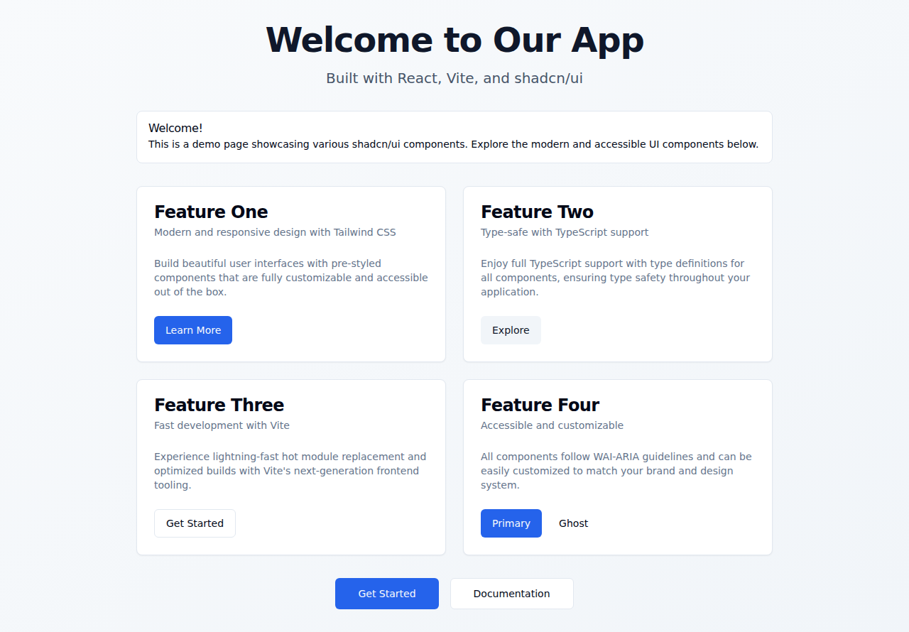

# agbr-test

A modern React application built with Vite, TypeScript, shadcn/ui, and agent-browser for automated testing.



## 🚀 Tech Stack

- **React 19.2.0** - Latest React version with improved performance and features
- **Vite 7.3.1** - Next-generation frontend tooling with lightning-fast HMR
- **TypeScript 5.9.3** - Type-safe development experience
- **Tailwind CSS 3.x** - Utility-first CSS framework
- **shadcn/ui** - Beautiful, accessible UI components built with Radix UI
- **agent-browser** - Browser automation CLI for AI agents and testing

## 📦 Dependencies

### Core Dependencies
- `react` (^19.2.0)
- `react-dom` (^19.2.0)

### UI Components
- `@radix-ui/react-slot` - Radix UI primitives
- `class-variance-authority` - CVA for component variants
- `clsx` - Utility for constructing className strings
- `tailwind-merge` - Merge Tailwind CSS classes without conflicts
- `lucide-react` - Beautiful icon library

### Development Tools
- `@vitejs/plugin-react` (^5.1.1)
- `tailwindcss` (^3)
- `tailwindcss-animate` - Animation utilities
- `autoprefixer` - PostCSS plugin for vendor prefixes
- `postcss` - CSS transformations
- `agent-browser` - Browser automation for screenshots and testing

## 🛠️ Setup & Installation

### Prerequisites
- Node.js (16+ recommended)
- npm or pnpm

### Installation

1. Clone the repository:
```bash
git clone https://github.com/IntranetFactory/agbr-test.git
cd agbr-test
```

2. Install dependencies:
```bash
npm install
```

3. Install browser automation tools:
```bash
npx agent-browser install
```

## 🚀 Development

Start the development server:
```bash
npm run dev
```

The application will be available at `http://localhost:5173`

## 🏗️ Build

Build for production:
```bash
npm run build
```

Preview production build:
```bash
npm run preview
```

## 🧹 Linting

Run ESLint:
```bash
npm run lint
```

## 📸 Screenshots

Take a screenshot of the welcome page:
```bash
./take-screenshot.sh
```

This script will:
1. Start the Vite dev server
2. Open the application in a headless browser
3. Capture a full-page screenshot
4. Save it to `screenshots/welcome.png`

## 📁 Project Structure

```
agbr-test/
├── public/              # Static assets
├── screenshots/         # Application screenshots
├── src/
│   ├── components/
│   │   └── ui/         # shadcn/ui components
│   │       ├── alert.tsx
│   │       ├── button.tsx
│   │       └── card.tsx
│   ├── lib/
│   │   └── utils.ts    # Utility functions
│   ├── App.tsx         # Main application component
│   ├── Welcome.tsx     # Welcome page component
│   ├── index.css       # Global styles with Tailwind
│   └── main.tsx        # Application entry point
├── index.html
├── package.json
├── tailwind.config.ts  # Tailwind configuration
├── tsconfig.json       # TypeScript configuration
├── vite.config.ts      # Vite configuration
└── take-screenshot.sh  # Screenshot automation script
```

## 🎨 Features

### Welcome Page
The welcome page showcases various shadcn/ui components:
- **Alert Component** - Informative alert with title and description
- **Card Components** - Four feature cards with titles, descriptions, and actions
- **Button Components** - Multiple button variants (default, secondary, outline, ghost)
- **Responsive Layout** - Grid layout that adapts to different screen sizes
- **Dark Mode Support** - Built-in dark mode capability (via CSS variables)

### UI Components
- Fully accessible components following WAI-ARIA guidelines
- Customizable through Tailwind CSS utilities
- Type-safe with TypeScript definitions
- Consistent design system with CSS variables

## 🔧 Configuration

### Path Aliases
The project uses TypeScript path aliases for cleaner imports:
- `@/*` maps to `./src/*`

Example:
```typescript
import { Button } from "@/components/ui/button"
```

### Tailwind Theme
Custom theme configuration includes:
- CSS variables for colors (supporting light/dark modes)
- Custom border radius values
- Extended color palette for shadcn/ui components

## 📝 Scripts

- `npm run dev` - Start development server
- `npm run build` - Build for production
- `npm run preview` - Preview production build
- `npm run lint` - Run ESLint
- `./take-screenshot.sh` - Capture application screenshot

## 🤖 agent-browser Usage

The project includes agent-browser for automated browser interactions:

```bash
# Take a screenshot
npx agent-browser open http://localhost:5173
npx agent-browser screenshot --full screenshots/welcome.png

# Get page snapshot (accessibility tree)
npx agent-browser snapshot

# Click elements
npx agent-browser click @ref

# Type into inputs
npx agent-browser fill @ref "text"
```

## 📄 License

This project is private and proprietary.

## 🙏 Acknowledgments

- [Vite](https://vite.dev/) - Build tool
- [React](https://react.dev/) - UI library
- [shadcn/ui](https://ui.shadcn.com/) - Component library
- [Tailwind CSS](https://tailwindcss.com/) - CSS framework
- [agent-browser](https://github.com/vercel-labs/agent-browser) - Browser automation
